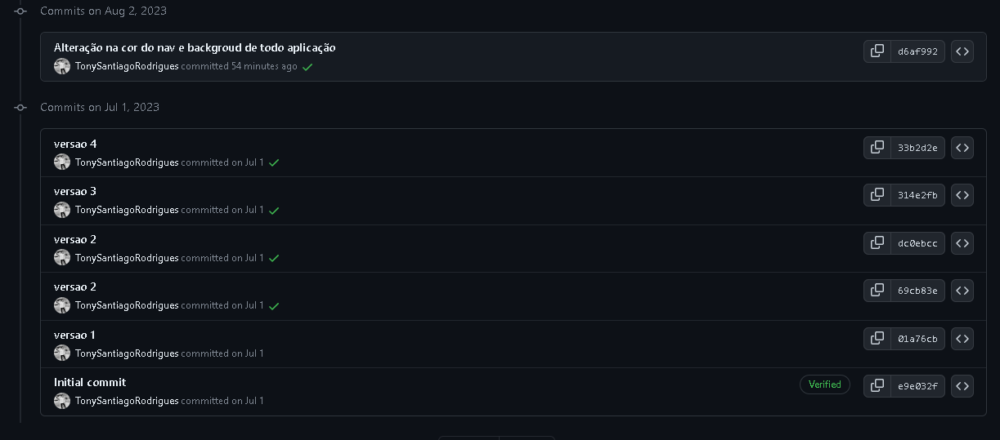

# Projeto-React
🧭Requisitos necessários:
💾 Vscode

Foi usada HTML5; CSS3; REACT.js; JavaScript na quais as versões são atuais do mês Agosto/2023.

O projeto funciona como um organizador de tarefas , nas quais foram alteradas apenas as cores da interface para melhor visão do cliente.

Segue abaixo o histórico de alterações do código até seu momento atual e a separação do código fonte para sua atualização:
 
 

O projeto em si é simples e código esta limpo , precisa de melhorias como mais ajustes na responsividade , fique a vontade para ajustar conforme sua necessidade.
